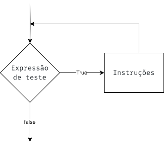
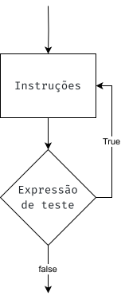
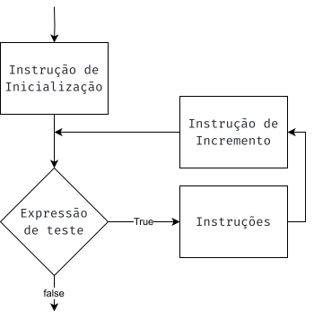

<style>
    section {
        font-size: 24pt;
    }

    .columns {
        display: grid;
        grid-template-columns: repeat(2, minmax(0, 1fr));
        gap: 1rem;
    }
</style>

# Algoritmos e Programação II

https://evandro-crr.github.io/alg2

<!-- _footer: Evandro Chagas Ribeiro da Rosa -->
<!-- _paginate: skip -->

---

# Revisão de Programação I

<div class="columns">

<div>

* **Expressão**: combinação de literais, variáveis e operadores que geram um valor. Ex.:
  - `2 + 5 * (x + 2)`
  - `pi * r * r`
  - `10 * (1.0 / 2.0)`

</div>

<div>

* **Instrução**: linha de código que realiza uma ação. Ex.:
  - `int a = 10;`
  - `x = 2 * a + 1;`
  - `if (...) ...`
  - `for (int i ...) ...`

</div>

</div>

---

## Expressão

Convertendo expressão algébrica para código 

| Expressão Algébrica | C++ Equivalente              |
| ------------------- | ---------------------------- |
| $6x$                | `6 * x`                      |
| $4xy$               | `4 * x * y`                  |
| $\frac{a+b}{c}$     | `(a + b) / c`                |
| $3\frac{x}{2}$      | `3 * (x / 2)`                |
| $3bc+4$             | `3 * b * c + 4`              |
| $\frac{2x+3}{4a-1}$ | `(2 * x + 3) / (4 * a - 1)`  |

---

# Expressões com Tipos Diferentes

<div class="columns">

<div>

Ranking dos tipos

- `long double`
- `double`
- `float`
- `unsigned long`
- `long`
- `unsigned int`
- `int`

</div>

<div>

- Em uma operação com tipos diferentes, o valor de menor ranking será promovido antes da operação.
- Em uma atribuição, o valor final será convertido para o tipo da variável sendo atribuída.

</div>

</div>

---

# Expressões com Tipos Diferentes

```cpp
int x, y = 4;
float z = 2.7;
x = y * z;
```

Qual o valor de `x`?

---

# Instruções de desvio condicional

<div class="columns">

<div>

```cpp
if (teste) {
  instrução;
  //...
}
```

```cpp
if (teste) {
  instrução;
  //...
} else {
  instrução;
  //...
}
```

</div>

<div>

- `teste` é uma expressão, normalmente usando operadores relacionais:
  - `x > y` maior que 
  - `x < y` menor que
  - `x >= y` maior ou igual
  - `x <= y` menor ou igual
  - `x == y` igual
  - `x != y` diferente 

</div>

</div>

---

# Instrução `switch-case`

<div class="columns">

<div>

```cpp
switch (teste) {
case expressão_constante:
    instrução;
    //...
    break;
case expressão_constante:
    instrução;
    //...
    break;
default:
    instrução;
    //...
}
```

</div>

<div>

- `teste` é uma expressão que resulta em um valor `int`.
- `expressão_constante` é uma expressão que deve ser definida em tempo de compilação, ou seja, o valor não pode ser definido dinamicamente durante a execução.

</div>

</div>

---

# Instruções de repetição `while`

<div class="columns">

<div>

```cpp
while(teste) {
    instrução; 
    //...
}
```

- As instruções dentro do *corpo* do `while` executam repetidamente até que a expressão `teste` resulte em falso.

</div>

<div>



</div>

</div>

---

# Instruções de repetição `do-while`

<div class="columns">

<div>

```cpp
do {
    instrução; 
    //...
} while(teste);
```

- As instruções dentro do *corpo* do `do` são executadas, e então a expressão `teste` é avaliada. Se resultar em verdadeiro, o corpo do `do` é executado novamente.

</div>

<div>



</div>

</div>

---

# Instruções de repetição `for`

<div class="columns">

<div>

```cpp
for (inicialização; teste; incremento) {
    instrução; 
    //...
}
```

- As instruções do *corpo* do `for` são executadas repetidamente enquanto a expressão de teste for verdadeira. A variável do teste é atualizada a cada iteração.

</div>

<div>



</div>

</div>

---

# Algoritmos e Programação II

https://evandro-crr.github.io/alg2

<!-- _footer: Evandro Chagas Ribeiro da Rosa -->
<!-- _paginate: skip -->
