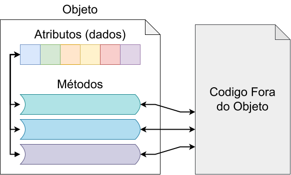

<style>
    section {
        font-size: 24pt;
    }

    .columns {
        display: grid;
        grid-template-columns: repeat(2, minmax(0, 1fr));
        gap: 1rem;
    }
</style>

# Algoritmos e Programação II

https://evandro-crr.github.io/alg2

---

## Introdução a Classes

- A **programação procedural** é centrada no uso
  de procedimentos/funções.
- Enquanto a **programação orientada a objetos** (POO)
  é centrada no uso de objetos.
- Um **objeto** é criado a partir de um tipo abstrato
  de dados (**classe**) que encapsula tanto dados
  quanto funções.

---

<div class="columns">
<div>

#### Exemplo de Programação Procedural

```cpp
struct Retangulo {
    double largura, altura;
};

double calcular_area(const Retangulo &r) {
    return r.largura * r.altura;
}

void mostrar_retangulo(const Retangulo &r) {
    cout << r.largura << "x" << r.altura << "\n";
}

int main() {
    Retangulo r{10, 20};
    cout << calcular_area(r) << "\n";
    mostrar_retangulo(r);
}
```

</div>
<div>

#### Exemplo de Programação Orientada a Objetos

```cpp
struct Retangulo {
    double largura, altura;

    double area() const {
        return largura * altura;
    }

    void mostrar() const { 
        cout << largura << "x" << altura << "\n";
    }
};

int main() {
    Retangulo r{10, 20};
    cout << r.area() << "\n";
    r.mostrar();
}
```


</div>
</div>


---

## Encapsulamento


<div class="columns">
<div>


Um objeto contém
- Dados: chamados de atributos
- Procedimentos: chamados de funções membro ou métodos 


</div>
<div>

- Os dados do objeto devem
  ser acessados através dos métodos.
- O objetivo do encapsulamento é manter
  o objeto em um estado válido.


</div>
</div>

---



- Os métodos formam
  uma interface para o
  resto do código.
- Podemos mudar a estrutura interna do objeto sem mudar o código externo.
- Um objeto pode estar
  em diferentes estados.

---

## Exemplo de Encapsulamento

<div class="columns">
<div>


Gerado por IA

</div>
<div>

- Os pedais e o volante são
  uma interface para o carro.
- Não é necessário ser mecânico para dirigir
  um carro.

- Em programação, usamos classes criadas por outros, como `string` e `vector`.
- Não é necessário entender como a classe é criada para usá-la, apenas conhecer sua interface.


</div>
</div>

---

## Classes e Objetos

- Uma classe é uma entidade que descreve
  um objeto, mas não é o objeto em si.
- O objeto é construído a partir de uma classe.
- Dizemos que um objeto é uma instânciade uma classe.

**Exemplo**
- A planta de uma casa é uma classe.
- A casa construída a partir da planta é um objeto.
- Podemos construir diversas casas com base na mesma planta.

---

## Classes em C++


<div class="columns">
<div>

```cpp
class Retangulo {
  private:
    double largura, altura;

  public:
    void set_largura(double valor) {
        if (valor < 0) valor = 0;
        largura = valor;
    }
    void set_altura(double valor) {
        if (valor < 0) valor = 0;
        altura = valor;
    }
    double get_largura() const {
        return largura;
    }
    double get_altura() const {
        return altura;
    }
    double area() const {
        return largura * altura;
    }
    void mostrar() const {
        cout << largura << "x" << altura << "\n";
    }
};
```

</div>
<div>

- Uma classe possui membros **públicos** e **privados**.
- Membros privados só podem ser acessados pela própria classe.
- Membros públicos podem ser acessados livremente.
- Métodos `const` não alteram o objeto.

```cpp
int main() {
    Retangulo r;
    r.set_largura(10);
    r.set_altura(20);
    cout << r.area() << "\n";
}
```

</div>
</div>

---

## Separando Definição de Implementação

- É comum separar a definição de uma classe de sua implementação em arquivos diferentes.
- A definição da classe é feita em um arquivo de cabeçalho `.hpp`.
- A implementação é feita em um arquivo `.cpp`.


---

<div class="columns">
<div>

```cpp
// retangulo.hpp
#pragma once

class Retangulo {
  private:
    double altura, largura;
  public:
    void set_largura(double valor);
    void set_altura(double valor);
    double get_largura() const;
    double get_altura() const;
    double get_area() const;
};
```

```cpp
// main.cpp
#include "retangulo.hpp"
#include <iostream>

int main() {
    Retangulo r;
    r.set_altura(10);
    r.set_largura(20);
    cout << r.get_largura() << "x"
         << r.get_altura() << "\n";
}
```

</div>
<div>

```cpp
// retangulo.cpp
#include "retangulo.hpp"

void Retangulo::set_largura(double valor) {
    if (valor < 0)
        valor = 0;
    largura = valor;
}
void Retangulo::set_altura(double valor) {
    if (valor < 0)
        valor = 0;
    altura = valor;
}
double Retangulo::get_largura() const { 
    return largura;
}
double Retangulo::get_altura() const { 
    return altura;
}
double Retangulo::get_area() const { 
    return get_altura() * get_largura();
}
```

```bash
g++ retangulo.cpp main.cpp -o executavel
```

</div>
</div>

---

<div class="columns">
<div>

```cpp
// retangulo.hpp
#pragma once

class Retangulo {
  private:
    double altura, largura;
  public:
    void set_largura(double valor);
    void set_altura(double valor);
    double get_largura() const;
    double get_altura() const;

    double get_area() const {
        return get_altura() * get_largura();
    }
};
```

- `Retangulo::get_area` é considerado **inline**.
- Funções inline são tratadas de forma diferente pelo compilador.

</div>
<div>

```cpp
// retangulo.hpp
#pragma once

class Retangulo {
  private:
    double altura, largura;
  public:
    void set_largura(double valor);
    void set_altura(double valor);
    double get_largura() const;
    double get_altura() const;
    double get_area() const;
};

double Retangulo::get_area() const { 
    return get_altura() * get_largura();
}
```

- `Retangulo::get_area` pode gerar problemas de definição múltipla.

</div>
</div>

---

## Funções e Métodos Inline

<div class="columns">
<div>

- Cada arquivo `.cpp` gera um arquivo objeto (`.o`).
- Uma função deve ser definida em um único arquivo objeto.
- Funções ocupam espaço na memória, e a chamada de uma função gera um desvio no fluxo de execução.

</div>
<div>

- Funções inline nem sempre geram um código na memória.
- O compilador pode substituir a chamada de uma função inline pelo código da função.
- Funções inline podem resultar em executáveis mais rápidos, porém, maiores.

</div>
</div>


---

## Ferramenta para Auxiliar na Compilação

- Separar seu código em vários arquivos facilita e melhora a organização.
- Muitas vezes usamos código de terceiros em nossos projetos.
- Conforme o número de arquivos aumenta, compilar manualmente se torna mais difícil.
- Há ferramentas que auxiliam na compilação do código.
- O CMake é uma das ferramentas mais usadas para ajudar na compilação. Está disponível para vários sistemas operacionais, e o VS Code possui suporte para CMake.

```cmake
# CMakeLists.txt
cmake_minimum_required(VERSION 3.10)
project(retangulo)
add_executable(executavel retangulo.cpp main.cpp)
```

---

## Construtor 

<div class="columns">
<div>

```cpp
#include <iostream>

using namespace std;

class Classe {
  public:
    Classe();
};

Classe::Classe() {
    cout << "Construindo objeto\n";
}

int main() {
    Classe objeto;

    cout << "O objeto foi construído\n";
}
// Construindo objeto
// O objeto foi construído
```

</div>
<div>

- O construtor é um método especial sem retorno que é chamado quando uma instância da classe é criada.
- O construtor é o método responsável por inicializar os atributos do objeto.

</div>
</div>

---

## Construtor com Parâmetros

<div class="columns">
<div>

```cpp
class Retangulo {
  private:
    double largura, altura;

  public:
    Retangulo(double v_largura, double v_altura)
    {
        largura = v_largura;
        altura = v_altura;
        cout << "Construindo Retângulo\n";
    }
};
```

```cpp
int main() {
    Retangulo a{10, 20};
    Retangulo b(10, 20);
}
```

</div>
<div>

```cpp
class Retangulo {
  private:
    double largura, altura;

  public:
    Retangulo(double largura, double altura)
        : largura{largura}, altura{altura}
    {
        cout << "Construindo Retângulo\n";
    }
};
```

- Podemos chamar o construtor com `(...)` ou `{...}`
- O uso de `{...}` é preferível.

</div>
</div>

---

## Sobrecarga de Construtores

<div class="columns">
<div>

```cpp
class Retangulo {
  private:
    double largura, altura;

  public:
    Retangulo(double largura, double altura)
        : largura{largura}, altura{altura}
    {}

    Retangulo(double valor)
        : largura{valor}, altura{valor}
    {}

    Retangulo()
        : largura{0}, altura{0}
    {}
};
```

</div>
<div>

```cpp
int main() {
    Retangulo retangulo{10, 20};
    Retangulo quadrado{10};
    Retangulo zero;
}
```

- Podemos definir vários construtores para a mesma classe.
- O construtor sem nenhum argumento é usado como construtor padrão.

</div>
</div>

---

## Construtor Padrão

- Caso nenhum construtor seja definido, será criado um construtor padrão vazio, e os atributos do objeto serão inicializados com valores de lixo de memória.
- O objeto deve ser sempre inicializado por um construtor.
- Um dos princípios da programação orientada a objetos é que o estado interno do objeto seja sempre válido.
- O ideal é sempre definir ao menos um construtor.
- O construtor padrão é necessário para criarmos um array de objetos.
  ```cpp
  Retangulo arr[10];
  ```

---

## Destrutor

<div class="columns">
<div>

```cpp
class Classe {
  public:
    Classe();
    ~Classe();
};

Classe::Classe() { 
    cout << "Construindo objeto\n";
}
Classe::~Classe() { 
    cout << "Destruindo o objeto\n";
}

int main() {
    Classe objeto;

    cout << "O objeto foi construído\n";
    cout << "O programa acabou\n";
}
// Construindo objeto
// O objeto foi construído
// O programa acabou
// Destruindo o objeto
```

</div>
<div>

- O destrutor é um método especial que é executado ao final da vida do objeto.
- O destrutor é muito usado para liberar memória alocada dinamicamente pelo objeto.
- O destrutor não recebe nenhum parâmetro.
- Não é possível fazer sobrecarga do destrutor.

</div>
</div>

---

<div class="columns">
<div>

```cpp
class Contato {
  private:
    char *_nome, *_tel;

  public:
    Contato(const char *nome, const char *tel)
        : _nome{new char[strlen(nome) + 1]},
          _tel{new char[strlen(tel) + 1]}
    {
        strcpy(_nome, nome);
        strcpy(_tel, tel);
    }
    ~Contato() {
        delete[] _nome;
        delete[] _tel;
    }
    const char *nome() const {
        return _nome;
    }
    const char *tel() const {
        return _tel;
    }
};

int main() {
    Contato c{"Bob", "(11) 91234-1234"};
    cout << c.nome() << " "
         << c.tel() << "\n";
}
```

</div>
<div>

### Exemplo de Uso de Destrutor

- A classe `Contato` usa alocação dinâmica para armazenar um nome e um telefone de tamanho arbitrário.
- O construtor aloca dinamicamente memória, e o destrutor desaloca essa memória.
- O gerenciamento de memória é feito pela classe.

</div>
</div>

---

## Exemplo de Código

Classe de vetor que verifica o limite do array.

```cpp
// vector_int.h
#pragma once
#include <cstdint>

class vector_int {
  private:
    int *data;
    std::size_t total_size, _size;

  public:
    vector_int(std::size_t total_size);
    ~vector_int();
    std::size_t size() const;
    bool insert(std::size_t index, int value);
    bool remove(std::size_t index);
    bool push(int value);
    int *get(std::size_t index);
};
```

---

`vector_int.cpp`

<div class="columns">
<div>

```cpp
#include "vector_int.h"

vector_int::vector_int(std::size_t total_size)
    : total_size{total_size},
      _size{0},
      data{new int[total_size]}
{}

vector_int::~vector_int() {
    delete[] data;
}

std::size_t vector_int::size() const {
    return _size;
}

bool vector_int::push(int value) {
    return insert(_size, value);
}

int *vector_int::get(std::size_t index) {
    if (index >= _size)
        return nullptr;
    return &data[index];
}
```

</div>
<div>

```cpp
bool vector_int::insert(std::size_t index, int value) {
    if (_size >= total_size || index > _size)
        return false;

    for (auto i = _size; i > index; --i)
        data[i] = data[i - 1];

    data[index] = value;
    _size++;
    return true;
}

bool vector_int::remove(std::size_t index) {
    if (index >= _size)
        return false;

    for (auto i = index; i < _size - 1; ++i)
        data[i] = data[i + 1];

    _size--;
    return true;
}
```

</div>
</div>

---

# Algoritmos e Programação II

https://evandro-crr.github.io/alg2

<!-- _footer: Evandro Chagas Ribeiro da Rosa -->
<!-- _paginate: skip -->